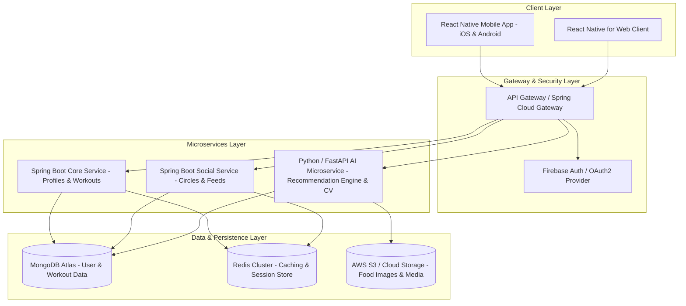

# SLIIT - BSc (Hons) in Information Technology
## IT3060 – Human Computer Interaction (Semester 2 2026)
### Lab Exercise 05: FitFlow Redesign - Technology Stack Selection, Architecture & Repository Setup

---

**Student / Project Details:**
* **Module Code & Name:** IT3060 – Human Computer Interaction
* **Project Title:** FitFlow Mobile Application Redesign
* **GitHub Repository:** [https://github.com/Ravindu-Dev/fitflow-redesign.git](https://github.com/Ravindu-Dev/fitflow-redesign.git)
* **Date:** September 16, 2026

---

# TABLE OF CONTENTS
1. [Activity 1: Compare Frontend Frameworks](#activity-1-compare-frontend-frameworks)
2. [Activity 2: Compare Backend, Database, and Authentication Options](#activity-2-compare-backend-database-and-authentication-options)
3. [Activity 3: Technology Comparison Matrix](#activity-3-technology-comparison-matrix)
4. [Activity 4: Design a High-Level Architecture & ADR](#activity-4-design-a-high-level-architecture--adr)
5. [Activity 5: GitHub Repository Setup & Governance](#activity-5-github-repository-setup--governance)

---

# Activity 1: Compare Frontend Frameworks

## 1.1 Overview & Analysis of Strengths & Weaknesses

### 1. React Native (TypeScript)
* **Strengths:**
  - Cross-Platform Efficiency: Single JavaScript/TypeScript codebase targets iOS, Android, and Web (React Native for Web), lowering development time and costs.
  - Performance: The New Architecture (Fabric renderer and TurboModules) eliminates JS bridge bottlenecks, offering near-native performance.
  - Ecosystem & Community Support: Massive npm package ecosystem, active developer community, and easy integration with native modules.
  - Rich UI & Animations: Powerful animation packages (`react-native-reanimated`, Skia) support smooth 60+ FPS fitness workout flows.
* **Weaknesses:**
  - Requires writing native bridges for highly specialized platform APIs.
  - Slightly larger app bundle size compared to pure native Swift/Kotlin binaries.

### 2. Flutter (Dart)
* **Strengths:**
  - Pixel-Perfect Rendering: Uses custom rendering engine (Skia/Impeller) to deliver identical UI across iOS, Android, and desktop.
  - Fast Development: Hot reload enables rapid UI prototyping.
  - High Performance: Compiles directly to native ARM code.
* **Weaknesses:**
  - Requires learning the Dart programming language.
  - Interop with native AI/ML libraries requires writing custom platform channels.
  - Higher app bundle sizes and web SEO limitations.

### 3. Kotlin Multiplatform (KMP)
* **Strengths:**
  - Shared Logic with Native UI: Shares business logic (data layers, network calls) while retaining 100% native platform UI performance.
  - Native Integration: Direct interop with Android APIs and Swift interop on iOS.
* **Weaknesses:**
  - Multiplatform UI (Compose Multiplatform for iOS/Web) is evolving and less mature than React Native/Flutter.
  - Requires writing separate native UI code for each platform if Compose Multiplatform is not used.

### 4. Swift / SwiftUI (Native iOS)
* **Strengths:**
  - Peak Performance & Security: Maximum hardware speed, native smooth animations, and seamless Apple HealthKit & CoreML integration.
* **Weaknesses:**
  - Limited to Apple platforms only. Requires building a separate codebase in Kotlin for Android and React for Web, tripling team workload.

---

## 1.2 Comparison Across Key Criteria

| Criteria (Weight) | React Native | Flutter | Kotlin Multiplatform | Swift / SwiftUI |
|---|---|---|---|---|
| **Development Speed (15%)** | 9/10 | 8/10 | 6/10 | 4/10 |
| **Code Reusability (15%)** | 9/10 | 9/10 | 7/10 | 2/10 |
| **Performance (15%)** | 8/10 | 9/10 | 9/10 | 10/10 |
| **Ecosystem Support (10%)** | 9/10 | 8/10 | 6/10 | 8/10 |
| **Learning Curve (10%)** | 8/10 | 7/10 | 6/10 | 7/10 |
| **Web Compatibility (5%)** | 8/10 | 6/10 | 5/10 | 1/10 |
| **AI/ML Integration (10%)** | 8/10 | 7/10 | 8/10 | 9/10 |
| **Real-time Features (10%)** | 9/10 | 8/10 | 8/10 | 9/10 |
| **Maintenance Cost (5%)** | 8/10 | 8/10 | 6/10 | 4/10 |
| **Security (5%)** | 8/10 | 8/10 | 9/10 | 9/10 |
| **Weighted Total Score** | **8.55 / 10** | **8.15 / 10** | **7.15 / 10** | **6.10 / 10** |

---

## 1.3 Evaluation & Final Recommendation for FitFlow
FitFlow requires rapid development speed to reverse declining user retention, cross-platform mobile delivery (iOS & Android), and dynamic UI animations for workout routines.

* **Recommendation:** **React Native (TypeScript)** with `react-native-reanimated` for workout guidance animations and TensorFlow Lite native bindings for client-side AI processing.

---

# Activity 2: Compare Backend, Database, and Authentication Options

## 2.1 Backend Framework Comparison

| Framework | Language | Performance | Scalability | AI/ML Integration | Dev Speed | Security & Ecosystem | Recommendation |
|---|---|---|---|---|---|---|---|
| **Spring Boot** | Java | Very High (Virtual Threads) | Enterprise High | Moderate | High | Excellent (Spring Security) | **Selected for Core API** |
| **Node.js / NestJS** | TypeScript | High (Event Loop) | High | Good | Very High | Good | Alternative |
| **FastAPI** | Python | High (Async ASGI) | High | Outstanding (PyTorch/OpenCV) | Very High | Good | **Selected for AI Engine** |
| **Go (Gin)** | Go | Extremely High | Extremely High | Low (Requires Cgo) | High | Strong | Overkill for mid-sized team |

---

## 2.2 Database System Comparison

| Database | Model Type | Schema Flexibility | Health Data Query Performance | Real-time Support | GDPR/HIPAA Security | Selection |
|---|---|---|---|---|---|---|
| **MongoDB** | NoSQL Document | High (Dynamic plans & meal logs) | Excellent (JSON indexing) | Change Streams | Role-based access, Client-side encryption | **Selected Primary DB** |
| **PostgreSQL** | Relational SQL | Low (Rigid schema) | High (Complex join queries) | Logical Replication | Robust encryption & audit logs | Alternative |
| **Firebase Firestore**| NoSQL Document | High | Moderate (Query limits) | Native listeners | GCP IAM compliance | Selected for Feeds |
| **DynamoDB** | Key-Value | High | High (Low latency) | DynamoDB Streams | KMS encryption | High query cost | Rejected |

---

## 2.3 Authentication & Authorization Comparison

| Solution | Protocol Support | Security & Compliance | Real-time & Social Auth | Cost / Pricing | Maintenance Effort | Selection |
|---|---|---|---|---|---|---|
| **Firebase Auth** | OAuth2, OIDC, Social Login | GDPR, SOC 2, ISO 27001 | Native SDK integration | Generous free tier | Low (Managed) | **Selected Primary Auth** |
| **AWS Cognito** | OAuth2, OIDC, SAML | HIPAA Eligible, GDPR | AWS SDK integration | Low pay-per-MAU | Moderate | Alternative |
| **Auth0** | OAuth2, OIDC, Enterprise | HIPAA & GDPR | Broad SDK support | Expensive at scale | Very Low | Rejected (Cost) |
| **Supabase Auth**| OAuth2, Magic Links | GDPR Compliant | Postgres RLS | Low | Low | Alternative |

---

## 2.4 Security & Compliance Analysis (HIPAA / GDPR)
- **GDPR / CCPA:** Explicit consent management, telemetry anonymization, data portability, and user deletion cascading across MongoDB stores.
- **Data Encryption:** TLS 1.3 for all data in transit; AES-256 encryption at rest for MongoDB document stores.

---

## 2.5 Recommended Technology Combination
- **Core Backend:** **Java Spring Boot** (Microservices API)
- **AI Microservice:** **Python FastAPI** (Workout recommendation & food image computer vision)
- **Primary Database:** **MongoDB Atlas** (Flexible NoSQL document database)
- **Authentication:** **Firebase Auth** with JWT token validation

---

# Activity 3: Technology Comparison Matrix

## 3.1 Consolidated Decision Matrix & Scoring

| Criteria (Weight) | React Native (FE) | Spring Boot (BE) | MongoDB (DB) | Firebase Auth (AUTH) | Python FastAPI (AI) |
|---|---|---|---|---|---|
| **Development Speed (20%)** | 9/10 (1.80) | 8/10 (1.60) | 9/10 (1.80) | 9/10 (1.80) | 9/10 (1.80) |
| **Scalability (15%)** | 8/10 (1.20) | 9/10 (1.35) | 9/10 (1.35) | 9/10 (1.35) | 8/10 (1.20) |
| **AI/ML Support (15%)** | 8/10 (1.20) | 8/10 (1.20) | 9/10 (1.35) | 7/10 (1.05) | 10/10 (1.50) |
| **Security & Privacy (15%)** | 8/10 (1.20) | 10/10 (1.50) | 8/10 (1.20) | 9/10 (1.35) | 7/10 (1.05) |
| **Maintainability (15%)** | 9/10 (1.35) | 9/10 (1.35) | 8/10 (1.20) | 9/10 (1.35) | 8/10 (1.20) |
| **Performance (10%)** | 8/10 (0.80) | 9/10 (0.90) | 8/10 (0.80) | 8/10 (0.80) | 8/10 (0.80) |
| **Cost Efficiency (10%)** | 9/10 (0.90) | 8/10 (0.80) | 8/10 (0.80) | 9/10 (0.90) | 9/10 (0.90) |
| **Weighted Total** | **8.45 / 10** | **8.70 / 10** | **8.50 / 10** | **8.60 / 10** | **8.45 / 10** |

---

# Activity 4: Design a High-Level Architecture & ADR

## 4.1 System Architecture Diagram



---

## 4.2 Critical Feature Data Flow Diagrams

### Data Flow 1: AI Personalized Workout Plan ("Daily Flow")
1. **User Request:** React Native client sends `GET /api/v1/workouts/daily-flow` with JWT.
2. **Auth & Routing:** API Gateway validates JWT via Firebase Auth middleware and forwards request to Spring Boot Core API.
3. **Data Fetching:** Spring Boot fetches user preferences and recent workout logs from MongoDB.
4. **AI Generation:** Spring Boot passes metadata to Python FastAPI AI Service (`POST /ai/generate-plan`).
5. **Model Execution:** Python service runs TensorFlow recommendation model and returns tailored workout plan JSON.
6. **Response:** Spring Boot persists the recommended plan to MongoDB and returns it to the client for UI rendering.

### Data Flow 2: Camera-Based Nutrition Logging (Computer Vision)
1. **Image Capture:** User takes a meal photo in React Native mobile app.
2. **Image Upload:** Mobile app sends `POST /api/v1/nutrition/recognize` with image payload.
3. **Computer Vision Inference:** API Gateway routes payload to Python FastAPI AI service running OpenCV & PyTorch image recognition models.
4. **Recognition Response:** AI service identifies food items, estimates portion size/calories, and returns predictions with confidence scores.
5. **Confirmation & Persistence:** User confirms/adjusts identified food items, and app submits confirmed meal entry to MongoDB.

### Data Flow 3: Private Social Circles & Activity Feed
1. **Post Event:** User completes workout and posts update to private circle (`POST /api/v1/social/circles/{id}/post`).
2. **Persistence:** Spring Boot Social Service inserts post document into MongoDB.
3. **Cache Invalidation:** Social Service invalidates Redis feed cache and pushes real-time WebSocket update to circle members.

---

## 4.3 Architecture Decision Record (ADR-001)

* **Title:** Selection of React Native, Spring Boot, MongoDB, and Python AI Microservice for FitFlow Redesign
* **Status:** Approved
* **Context:** FitFlow suffered a retention drop (3.8 stars) due to static workouts, tedious nutrition logging, and poor social accountability. The team required a modular, scalable architecture supporting fast mobile delivery, real-time social feeds, and machine learning components.
* **Decision:** We adopted React Native for cross-platform mobile frontend, Java Spring Boot for backend microservices, MongoDB Atlas for NoSQL document storage, Python FastAPI for the AI microservice, and Firebase Auth for authentication.
* **Consequences:**
  - *Positive:* High code reuse across iOS/Android (>85%), decoupled scaling of computationally heavy AI workloads, flexible schema for evolving fitness metrics.
  - *Negative:* Increased operational complexity from managing a multi-language stack (Java, Python, TypeScript).

---

# Activity 5: GitHub Repository Setup & Governance

## 5.1 Project Folder Structure
```
fitflow-redesign/
├── frontend/                               # React Native mobile application codebase
├── backend/                                # Spring Boot backend API service codebase
├── ai-service/                             # Python AI & Computer Vision microservice codebase
└── docs/                                   # Lab Exercise 05 Documentation Suite
    ├── activity1-frontend-comparison.md    # Activity 1: Frontend analysis
    ├── activity2-backend-database-auth.md  # Activity 2: Backend, DB & Auth analysis
    ├── activity3-weighted-decision-matrix.md# Activity 3: Weighted decision matrix
    ├── activity4-architecture-and-adr.md   # Activity 4: Architecture diagram & ADR-001
    ├── FitFlow_Redesign_Lab_Report_05.md   # Master Lab 5 Report Document
    ├── tech-stack-summary.md               # Executive Tech Stack Summary
    ├── comparison-matrix.md                # Quick Matrix Reference
    └── architecture-diagram.md             # System Diagram Overview
```

---

## 5.2 Configured `.gitignore` File
```gitignore
# Dependencies
node_modules/
/.pnp
.pnp.js

# Testing & Coverage
/coverage

# Production & Builds
/build
/dist
/out
*.apk
*.aab
*.ipa
target/
.gradle/

# React Native / Expo
.expo/
.expo-shared/

# Java / Spring Boot compiled files
*.class
*.jar
*.war
*.ear

# Python / AI Service
__pycache__/
*.pyc
*.pyo
venv/
.venv/
env/
*.onnx
*.pth
*.h5

# Logs
*.log
npm-debug.log*
yarn-debug.log*
yarn-error.log*

# Environment Variables & Secrets
.env
.env.local

# IDEs & System Files
.idea/
.vscode/
*.swp
*.iml
.DS_Store
Thumbs.db
```

---

## 5.3 Git Terminal Execution & Push Commands
```bash
# 1. Initialize local repository
mkdir -p fitflow-redesign
cd fitflow-redesign
git init
git branch -M main

# 2. Add remote origin
git remote add origin https://github.com/Ravindu-Dev/fitflow-redesign.git

# 3. Stage files and make initial commit
git add .
git commit -m "Initial commit: Set up repository structure, docs, gitignore, and README for FitFlow redesign"

# 4. Push local main branch to GitHub
git push -u origin main
```

---

## 5.4 GitHub Branch Protection Rule Configuration Guide
1. Navigate to your repository on GitHub: `https://github.com/Ravindu-Dev/fitflow-redesign`.
2. Click **Settings** > **Branches** under "Code and automation".
3. Click **Add branch protection rule** (or **Add rule**).
4. Enter `main` in the **Branch name pattern** field.
5. Enable the following settings:
   - ✅ **Require a pull request before merging** (Set minimum approvals to 1).
   - ✅ **Require status checks to pass before merging**.
   - ✅ **Do not allow bypassing the above settings**.
6. Click **Create** or **Save changes**.

---

### Official Repository URL:
🔗 [https://github.com/Ravindu-Dev/fitflow-redesign.git](https://github.com/Ravindu-Dev/fitflow-redesign.git)
