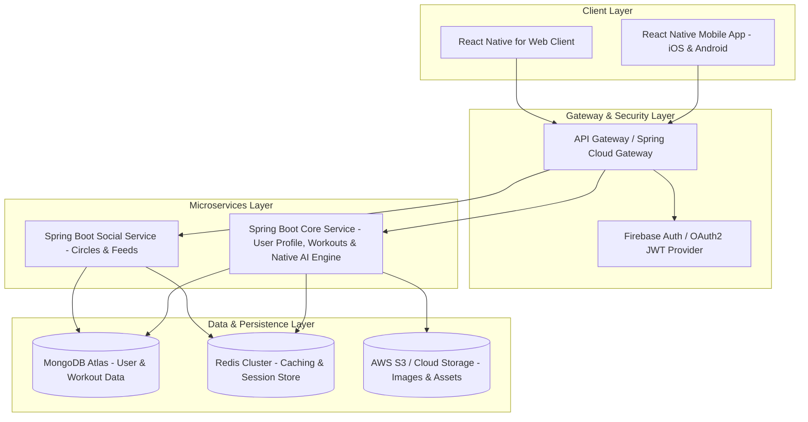
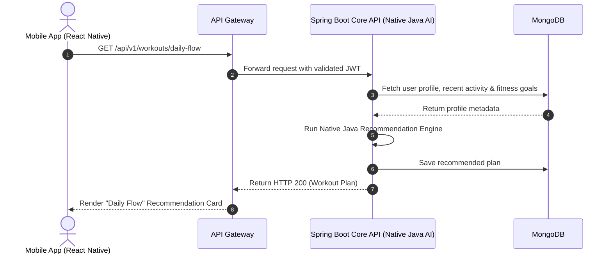
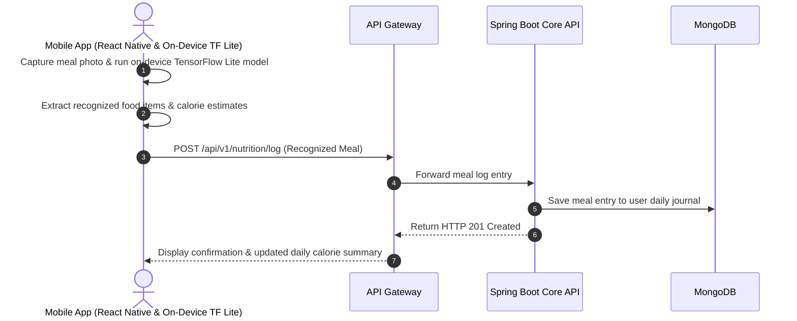
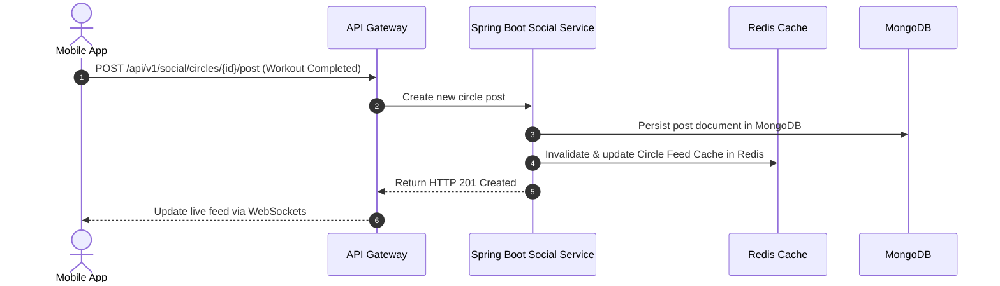

# Activity 4: High-Level Architecture & Architecture Decision Record (ADR) - FitFlow Redesign

## 1. Overview
This document presents the complete system architecture for the **FitFlow Redesign**, illustrating system components, data flows, security mechanisms, scalability strategies, and the formal Architecture Decision Record (ADR).

---

## 2. System Architecture Diagram

---

## 3. Data Flow Diagrams for Key Features

### 3.1 Feature 1: Personalized AI Workout Recommendation ("Daily Flow")

### 3.2 Feature 2: Camera-Based Nutrition Logging (Computer Vision)

### 3.3 Feature 3: Private Social Circles & Activity Feed

---

## 4. Architecture Decision Record (ADR)

### ADR-001: Selection of React Native, Spring Boot, and MongoDB for FitFlow Redesign

* **Status:** Approved
* **Date:** 2026-09-16
* **Deciders:** FitFlow Redesign Product & Engineering Team

#### Context & Problem Statement
FitFlow experienced a significant decline in user retention (drop to 3.8 stars) due to generic workout recommendations, high friction in nutrition tracking, and lack of social accountability. The engineering team requires a modernized technology stack capable of supporting:
1. Fast cross-platform mobile delivery for iOS and Android.
2. Enterprise-grade, scalable API backend.
3. Flexible storage for dynamic health metrics and meal logs.
4. Native Java AI recommendation algorithms and on-device computer vision food recognition.

#### Decision
We decided to adopt:
- **Frontend:** React Native (TypeScript) with `react-native-reanimated` & On-Device ML (TensorFlow Lite).
- **Backend Services:** Java Spring Boot for enterprise APIs, microservices, and native Java AI recommendation engine.
- **Database:** MongoDB Atlas (NoSQL) for high-performance schema flexibility.
- **Authentication:** Firebase Auth with JWT verification.

#### Consequences
* **Positive Consequences:**
  - High code reusability (>85%) across mobile platforms using React Native.
  - Native Java execution of AI recommendations in Spring Boot and on-device ML in React Native eliminates external service latency and multi-language deployment overhead.
  - MongoDB document model eliminates complex SQL migrations when adding new fitness attributes.
* **Negative Consequences:**
  - Requires maintaining proper contract definitions (OpenAPI/Swagger) across services.

---

## 5. Security & Scalability Considerations
- **Security:** OAuth2/JWT authentication, TLS 1.3 encryption for data in transit, AES-256 for data at rest in MongoDB Atlas, and strict GDPR compliance for anonymized health data.
- **Scalability:** Horizontal scaling of Spring Boot backend instances via Kubernetes/Docker; Redis caching layer for sub-10ms feed reads; on-device client processing for computer vision tasks.
