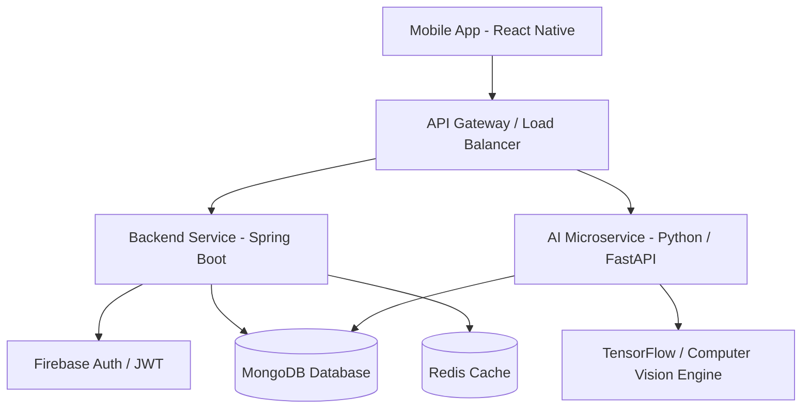

# High-Level Architecture Diagram & System Design - FitFlow Redesign

## 1. High-Level System Architecture

## 2. Core Data Flow & Interaction
1. **User Request:** The client app interacts with the API Gateway via HTTPS/REST & WebSockets.
2. **Authentication:** Spring Boot verifies authentication state using Firebase Auth/JWT middleware.
3. **Data Storage:** User profiles, workout history, and social feeds are persisted in MongoDB.
4. **AI Processing:** AI requests (workout recommendations, food image recognition) route to the AI Microservice.
