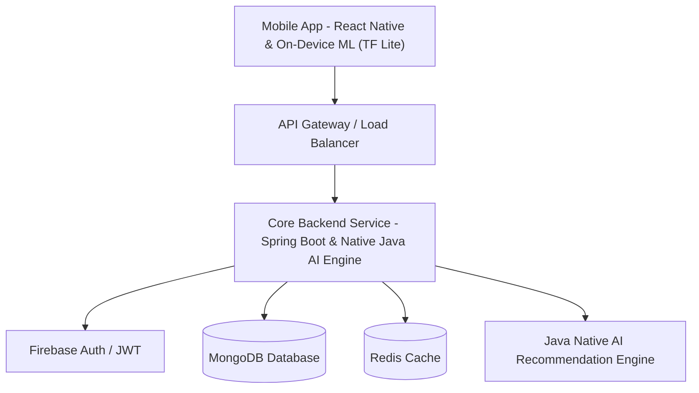

# High-Level Architecture Diagram & System Design - FitFlow Redesign

## 1. High-Level System Architecture

## 2. Core Data Flow & Interaction
1. **User Request:** The client app interacts with the API Gateway via HTTPS/REST & WebSockets. On-device computer vision tasks (e.g., pose tracking and meal image processing) are processed directly on the mobile client using TensorFlow Lite.
2. **Authentication:** Spring Boot verifies authentication state using Firebase Auth/JWT middleware.
3. **Data Storage:** User profiles, workout history, and social feeds are persisted in MongoDB.
4. **AI Recommendation Processing:** Personalized workout and nutrition recommendation algorithms are executed natively within the Java Spring Boot service backend.
